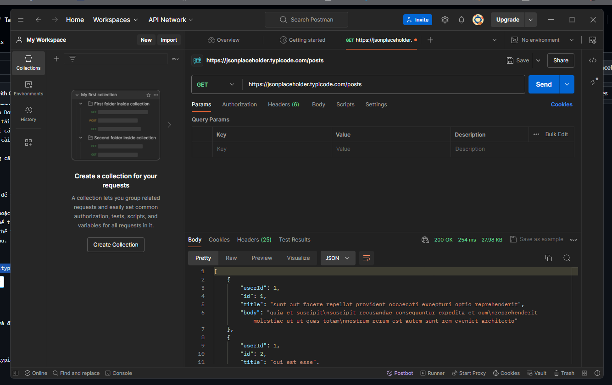
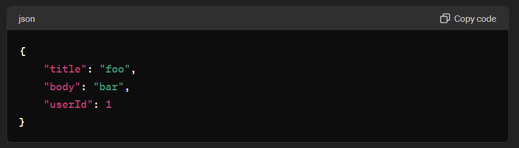
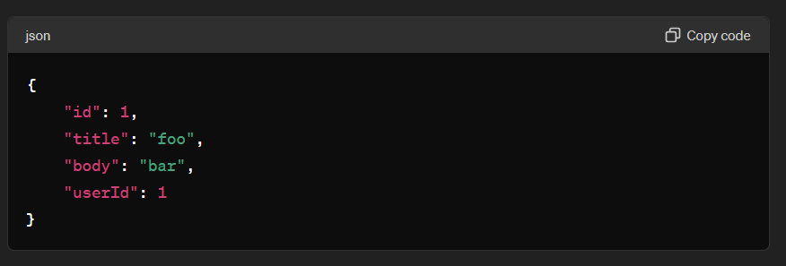
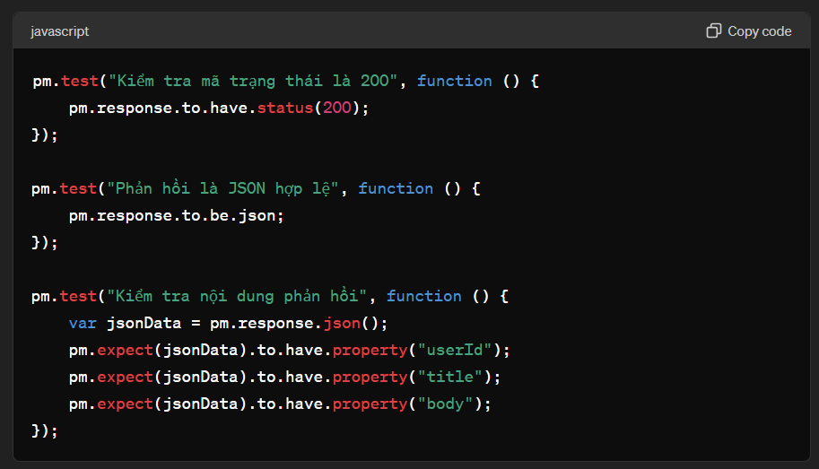
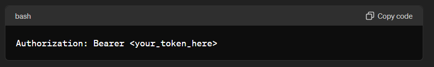
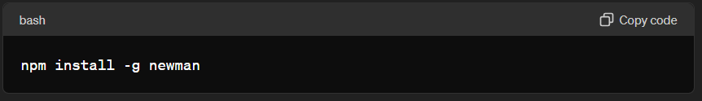
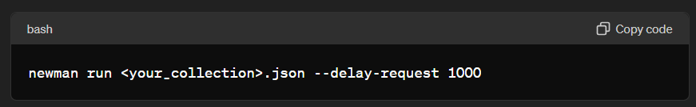
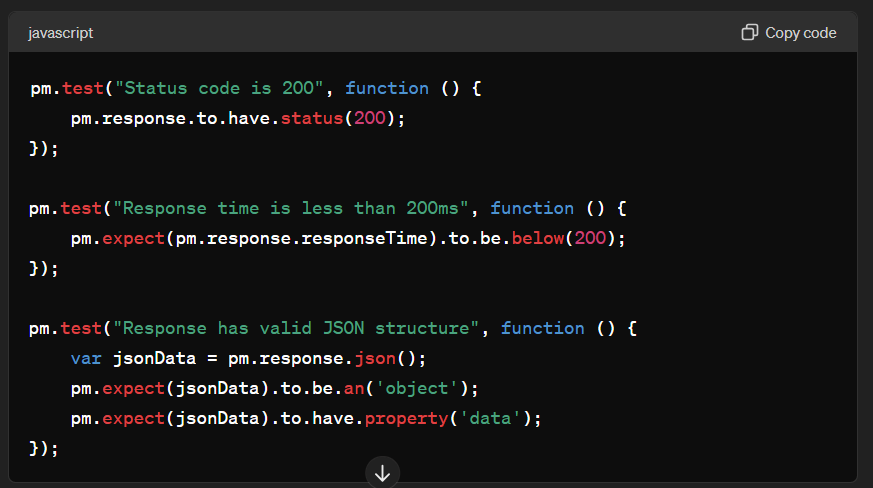
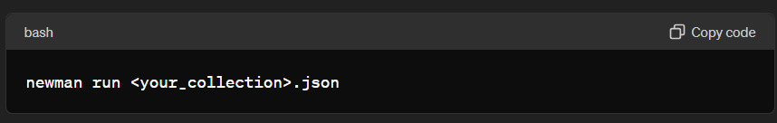

# TaskPostMan
Học sử dụng Postman - CALL API

# Bài tập
## 1. Giới thiệu Postman
  Postman là một công cụ cho phép chúng ta thao tác với API, phổ biến nhất là REST. Postman hiện là một trong những công cụ phổ biến nhất được sử dụng trong thử nghiệm các API1. Với Postman, ta có thể gọi Rest API mà không cần viết dòng code nào.

  Postman hỗ trợ tất cả các phương thức HTTP (GET, POST, PUT, PATCH, DELETE, …). Bên cạnh đó, nó còn cho phép lưu lại lịch sử các lần request, rất tiện cho việc sử dụng lại khi cần.

  Một số chức năng chính của Postman bao gồm:

  - Collections (Bộ sưu tập): Postman cho phép người dùng tạo bộ sưu tập cho các lệnh gọi API của họ. Mỗi bộ sưu tập có thể tạo các thư mục con và nhiều yêu cầu (request). Điều này giúp việc tổ chức các bộ thử nghiệm.
  - Collaboration: Collections và environment có thể được import hoặc export giúp chia sẻ tệp dễ dàng.
  - API Testing: Test trạng thái phản hồi HTTP.
  - Gỡ lỗi: Bảng điều khiển Postman giúp kiểm tra dữ liệu nào đã được truy xuất giúp dễ dàng gỡ lỗi kiểm tra.
  
  Postman cung cấp một giao diện dễ sử dụng, cho phép bạn gửi HTTP Request với các method GET, POST, PUT, DELETE, cho phép post dữ liệu dưới dạng form (key-value), text, json, và hiển thị kết quả trả về dạng text, hình ảnh, XML, JSON. 

  Để cài đặt Postman, bạn có thể thực hiện theo các bước sau:
  - Truy cập trang chủ của Postman: Truy cập vào trang chủ của Postman tại đây và chọn nền tảng bạn muốn tải về như Mac, Windows hoặc Linux.
  - Tải xuống Postman: Nhấp vào Download để tải xuống Postman.
  - Chạy file cài đặt: Sau khi tải xuống, mở file cài đặt và nhấp vào Run.
  - Tiến hành cài đặt: Theo dõi các hướng dẫn trên màn hình để hoàn tất quá trình cài đặt.
  - Khởi động Postman: Sau khi cài đặt xong, bạn có thể mở Postman và bắt đầu sử dụng.
  
  Lưu ý rằng, Postman cũng cung cấp phiên bản web, cho phép bạn sử dụng Postman ngay trong trình duyệt mà không cần cài đặt.

## 2. Kiểm thử API cơ bản
GET Request:

- Mở Postman và nhấp vào "New" để tạo một yêu cầu mới.
- Chọn "Request".
- Đặt tên cho yêu cầu và chọn hoặc tạo một bộ sưu tập để lưu trữ yêu cầu này.
- Trong tab "Params", bạn có thể thêm các tham số vào yêu cầu (nếu cần).
- Trong tab "Headers", bạn có thể thêm các tiêu đề HTTP (nếu cần).
- Nhấp vào "Send" để gửi yêu cầu.

Ví dụ:

- URL: https://jsonplaceholder.typicode.com/posts
- Phương thức: GET

POST Request:

- Tạo một yêu cầu mới như trên.
- Chọn phương thức POST.
- Trong tab "Body", chọn "raw" và định dạng "JSON".
- Nhập dữ liệu JSON cần gửi.

Ví dụ:

- URL: https://jsonplaceholder.typicode.com/posts.
- Phương thức: POST.

PUT Request:

- Tạo một yêu cầu mới.
- Chọn phương thức PUT.
- Trong tab "Body", chọn "raw" và định dạng "JSON".
- Nhập dữ liệu JSON cần cập nhật.

Ví dụ:

- URL: https://jsonplaceholder.typicode.com/posts/1
- Phương thức: PUT

DELETE Request:

- Tạo một yêu cầu mới.
- Chọn phương thức DELETE.
- Nhấp vào "Send" để gửi yêu cầu.

Ví dụ:

- URL: https://jsonplaceholder.typicode.com/posts/1.
- Phương thức: DELETE.

Bước 3: Kiểm tra mã trạng thái HTTP và nội dung phản hồi:

- Sau khi gửi yêu cầu, bạn sẽ thấy phản hồi trong phần dưới cùng của Postman.
- Kiểm tra mã trạng thái HTTP (Status Code) và nội dung phản hồi (Response Body).

Bước 4: Sử dụng các biến và bộ sưu tập dữ liệu trong Postman:

- Tạo một bộ sưu tập mới hoặc chọn một bộ sưu tập hiện có.
- Trong bộ sưu tập, bạn có thể tạo và sử dụng các biến để quản lý dữ liệu động.
- Trong tab "Variables" của bộ sưu tập, bạn có thể định nghĩa các biến.

Ví dụ:

- Tạo một biến có tên baseUrl với giá trị https://jsonplaceholder.typicode.com.
- Sử dụng biến này trong các yêu cầu: {{baseUrl}}/posts.

Bước 5: Xác minh tính hợp lệ của JSON:
- Trong tab "Tests" của mỗi yêu cầu, bạn có thể viết các đoạn mã JavaScript để kiểm tra tính hợp lệ của JSON.
- Sử dụng pm.response.json() để lấy dữ liệu JSON từ phản hồi và xác minh tính hợp lệ.

Ví dụ:

## 3. Kiểm thử API nâng cao

1. Kiểm tra Xác thực và Ủy quyền:
   
Xác thực (Authentication):

Thiết lập thông tin xác thực:

- Mở Postman và tạo một yêu cầu mới.
- Chuyển đến tab "Authorization".
- Chọn loại xác thực mà API của bạn yêu cầu (ví dụ: Basic Auth, Bearer Token, OAuth 2.0, API Key).
- Nhập thông tin xác thực cần thiết.

Ví dụ với Bearer Token:

Ủy quyền (Authorization):

Kiểm tra quyền truy cập:

- Gửi yêu cầu với thông tin xác thực đúng và kiểm tra xem bạn có thể truy cập các tài nguyên yêu cầu hay không.
- Gửi yêu cầu với thông tin xác thực sai hoặc thiếu và đảm bảo API trả về lỗi 403 Forbidden hoặc 401 Unauthorized.

2. Kiểm tra Hiệu suất API:

Sử dụng Postman và Newman.
- Cấu hình kịch bản kiểm thử: Tạo các bộ sưu tập kiểm thử (collections) trong Postman với các yêu cầu API cần kiểm tra.
- Chạy các kiểm thử bằng Newman: Cài đặt Newman, công cụ dòng lệnh của Postman.

- Chạy kiểm thử hiệu suất: Chạy bộ sưu tập kiểm thử bằng Newman và thêm cờ --delay-request để kiểm tra hiệu suất dưới tải trọng.
bash

- Sử dụng các công cụ kiểm thử hiệu suất khác: Apache JMeter - Một công cụ mạnh mẽ để kiểm thử tải trọng và hiệu suất của API.

3. Kiểm thử Bảo mật API

Các loại kiểm thử bảo mật:

- SQL Injection: Gửi các yêu cầu với payload chứa các đoạn mã SQL và kiểm tra xem API có bị tấn công hay không.
- Cross-Site Scripting (XSS): Gửi các yêu cầu với payload chứa mã JavaScript và kiểm tra xem API có bị tấn công hay không.
- Kiểm tra rate limiting: Gửi một số lượng lớn yêu cầu trong một khoảng thời gian ngắn và kiểm tra xem API có chặn các yêu cầu dư thừa hay không.
- Sử dụng Postman cho kiểm thử bảo mật: Tạo các yêu cầu với payload đặc biệt để kiểm tra các lỗ hổng bảo mật. Sử dụng các script trong tab "Pre-request Script" và "Tests" để tự động hóa các kiểm thử bảo mật.

4. Viết Các Kịch bản Kiểm thử Tự động bằng Postman:
  
- Sử dụng tab "Tests": Viết các script kiểm thử bằng JavaScript để kiểm tra các điều kiện phản hồi.

Ví dụ:

- Chạy các kịch bản kiểm thử tự động bằng Newman: Tạo và lưu các bộ sưu tập Postman dưới dạng JSON. Chạy các bộ sưu tập bằng Newman.

- Tích hợp với CI/CD: Tích hợp Newman vào pipeline CI/CD của bạn (ví dụ: Jenkins, GitLab CI/CD) để tự động chạy các kiểm thử mỗi khi có thay đổi mã nguồn.

## 4. Thực hành
- URL: https://jsonplaceholder.typicode.com/posts/1.
  

## 5. Tài liệu tham khảo
  - Postman: https://www.getpostman.com/
  - API Testing with Postman: https://www.youtube.com/watch?v=vCJVFnepECc&list=PLUDwpEzHYYLs3DYFqm79fIj2QOzPke_fW
  - Postman API Testing Tutorial: https://www.youtube.com/watch?v=MFxk5BZulVU
  
